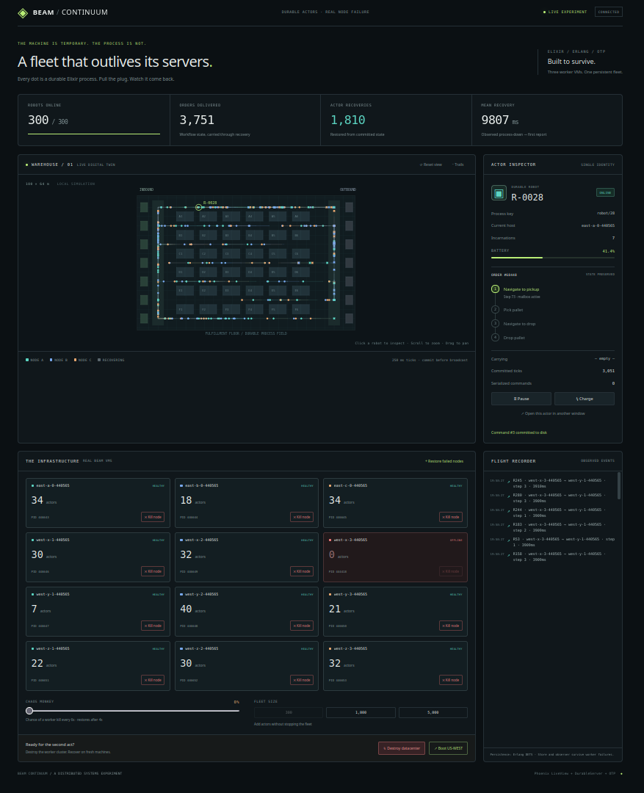

# BEAM Continuum



A live warehouse simulation that demonstrates durable processes in Elixir,
Erlang, and OTP. Each robot is a [DurableServer](https://github.com/phoenixframework/durable_server)
actor with its own position, battery, order, cargo, and workflow state.

Phoenix LiveView displays the fleet. Erlang DETS persists its state.
No Redis, Postgres, Docker, or cloud account is needed.

## Run

Requires Elixir 1.19+ and Erlang/OTP 28+ on Linux or macOS.

```sh
mix setup
mix demo
```

Open **http://localhost:4000**. One command starts the dashboard/storage VM
and **three separate worker BEAM VMs**. No additional instances are needed.
The fleet starts with 300 robots; the dashboard can add up to 5,000.

## Try it

- **Kill node:** abruptly kills one worker OS process. DurableServer recovers its
  robots on surviving workers, preserving their committed mission state.
- **Destroy datacenter → Boot US-WEST:** kills every worker. “The fleet is on disk”
  means the robots are offline until you boot fresh workers to resume them.
- **Chaos Monkey:** repeatedly kills and restores individual workers.
- **Open an actor in another window:** control the same robot from several
  browsers. Commands serialize through its single actor mailbox.

For a clear recovery demonstration, select a robot, pause it, and note its order,
cargo, and committed ticks. Kill its hosting node. Watch its host and incarnation
count change while its saved state remains intact, then click **Resume**.

## What this shows

A robot's identity and committed state can outlive the VM running it. OTP provides
the supervision and concurrency foundations; DurableServer adds persistence,
cluster placement, and recovery. State is committed before updates appear in the
dashboard or commands are acknowledged.

All VMs run on your machine; “East” and “West” are simulated region labels.
The dashboard and storage survive the worker crashes. This demonstrates recovery
of durable compute, not replicated storage or physical datacenter recovery.

State survives restarts in `data/fleet.dets`.

## Tests

```sh
mix test
mix run --no-start scripts/verify_cluster.exs
```

The integration check exercises a worker SIGKILL and recovery on a fresh cluster.
DurableServer 0.1.4 is vendored under `vendor/durable_server/` with its MIT license.
